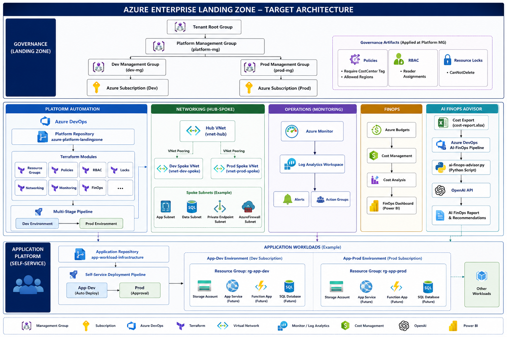

# Enterprise Azure Landing Zone with DevOps, FinOps and AI Cost Optimization

## Overview

This project demonstrates the implementation of an enterprise-scale Azure Landing Zone using Terraform, Azure DevOps, FinOps controls and AI-powered cost optimization.

The solution follows Microsoft Cloud Adoption Framework (CAF) principles and provides governance, infrastructure automation, networking, monitoring, cost management and application onboarding capabilities.

---

## Key Features

### Governance

* Enterprise Management Group hierarchy
* Azure Policies

  * Require CostCenter Tag
  * Allowed Regions
* Role-Based Access Control (RBAC)
* Resource Locks (CanNotDelete)

### Infrastructure as Code

* Terraform-based deployment
* Reusable Terraform modules
* Environment-specific deployments
* Dev and Prod environments

### Networking

* Hub-Spoke Architecture
* VNet Peering
* Environment Isolation

### Monitoring

* Azure Monitor
* Log Analytics Workspace
* Alerting Framework
* Action Groups

### FinOps

* Azure Budgets
* Cost Management
* Cost Governance
* Cost Reporting

### AI-Powered FinOps Advisor

Implemented using:

* Python
* OpenAI API
* Azure DevOps Pipeline

Workflow:

Cost Report (.xlsx)
→ AI FinOps Pipeline
→ Python Processing
→ OpenAI Analysis
→ Cost Optimization Recommendations

Example insights:

* Storage tier optimization opportunities
* Log Analytics retention recommendations
* Cost trend forecasting
* Resource utilization insights
* Potential monthly savings identification

### DevOps Automation

#### Platform Pipeline

Automated deployment of:

* Policies
* RBAC
* Locks
* Networking
* Monitoring
* FinOps Resources

using Azure DevOps multi-stage pipelines.

#### Self-Service Application Deployment

Application teams can provision workloads through dedicated Terraform pipelines without modifying platform resources.

---

## Architecture



---

## Management Group Hierarchy

```text
Tenant Root Group
│
└── platform-mg
    │
    ├── dev-mg
    │
    └── prod-mg
```

---

## Repository Structure

```text
azure-platform-landingzone
│
├── environments
│   ├── dev
│   └── prod
│
├── modules
│   ├── resource-groups
│   ├── policies
│   ├── rbac
│   ├── locks
│   ├── networking
│   ├── monitoring
│   └── finops
│
├── pipelines
│   ├── azure-pipelines.yml
│   └── ai-finops-pipeline.yml
│
├── scripts
│   ├── ai-finops-advisor.py
│   ├── input
│   └── output
│
└── docs
```

---

## Application Platform

A separate workload repository was created to support self-service deployments.

Implemented workload:

* Resource Group
* Storage Account

The design enables future onboarding of:

* App Services
* Azure Functions
* Databases
* AKS Workloads

---

## eShopOnWeb CI/CD Implementation

As part of the platform implementation, Azure DevOps CI/CD pipelines were configured for the eShopOnWeb application.

### CI Pipeline

* Restore
* Build
* Publish
* Artifact Generation

### CD Pipeline

* Bicep Deployment
* Azure Web App Deployment
* Automated Release

---

## Technologies Used

* Microsoft Azure
* Terraform
* Azure DevOps
* Azure Policy
* Azure RBAC
* Azure Monitor
* Log Analytics
* Azure Cost Management
* Python
* OpenAI API
* PowerShell
* Git

---

## Key Achievements

* Designed and implemented an enterprise Azure Landing Zone from scratch.
* Built reusable Terraform modules for platform services.
* Implemented governance using Policies, RBAC and Resource Locks.
* Automated Dev and Prod deployments using Azure DevOps.
* Implemented Hub-Spoke networking architecture.
* Integrated monitoring and operational visibility.
* Implemented FinOps controls and budgeting.
* Developed an AI-powered FinOps Advisor using OpenAI API.
* Enabled self-service application infrastructure deployments.
* Implemented CI/CD pipelines for application deployment.

---

## Future Enhancements

* Azure Key Vault
* Private Endpoints
* Azure Firewall
* Defender for Cloud
* AKS Integration
* Automated Azure Cost Export Processing
* AI-Driven Governance Recommendations

---

## Author

Chaitanya Varma

Enterprise Azure Landing Zone | Terraform | Azure DevOps | FinOps | AI Integration
